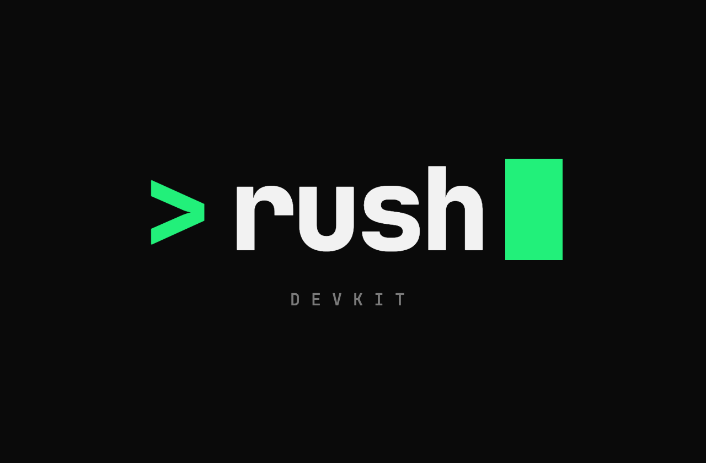

<div align="center">



**Spec-driven development and an agent harness for Claude Code.**

Drop it into your repository, run one command, and it adapts to *your* project (stack,
architecture, conventions, product) instead of imposing a generic process.

`v1.0.0` · MIT

</div>

---

## Why Rush

Spec-driven development with coding agents tends to fail in three predictable ways:

| What happens | Why |
|---|---|
| **Mountains of markdown**: 2,500 lines of spec for 600 lines of code | Every change is treated as a big change |
| **Features that don't connect**: each one works alone, the user journey breaks | Specs are written in isolation, with no contracts between features |
| **"Done" that isn't done** | The agent grades its own work and always passes |

Rush DevKit is built around those failures. Each one has a mechanical defense rather than a polite
request in a prompt.

## What you get

**A process sized to the problem.** `/rush` triages every request into **S / M / L** from
deterministic signals: files touched, contracts, migrations, new dependencies, sensitive paths.
Small changes go straight to code, medium ones get a lean spec, and only large ones run the full
flow.

**Features that connect by construction.** Every feature declares what it **provides** and what it
**consumes** in an `integration-map.md`, and a script validates it. A consumer with no provider, a
duplicate provider or a dependency cycle is a build error, not a warning. Interfaces shared by two
or more features live in `shared-contracts/` with a declared owner. User journeys become
**journey tests**: a feature can close on its own, but a delivery only closes when the flow across
features passes.

**"Done" you can execute.** Every task carries its own verification command. Every feature has a
`done-contract.md` with acceptance criteria, a JSON block of checks and the human gates, agreed
**before** the first line of code. Only the `rush-verifier` subagent can promote a task, and a hook
blocks anyone else who tries.

**A harness that enforces, not asks.** Commit policy, blocked commands, test editing, secret
scanning and sensitive paths are all declared in `.rush/config.json` and enforced by Claude Code
hooks. No safety rule lives only in prose.

**A gate that resolves instead of bouncing you around.** `/rush-analyze` checks spec, plan, tasks,
contracts, constitution and integration map for consistency, fixes what is mechanical, asks you
what is a decision, and gives a binary GO / NO-GO verdict in a **single run**.

**Built to keep token spend down.** Each skill pins its own model and effort, so `opus` is used
only where a decision is made once and inherited by everything after it. Artifacts have line
budgets. Each command reads one context pack instead of opening every document. Subagents run in
isolated contexts and return only their result.

**A ratchet, not a rulebook.** `/rush-retro` turns every real failure into a permanent mechanism
(an eval case, a fitness function, a hook) and retires rules that never fire.

## Quick start

Requirements: [Claude Code](https://claude.com/claude-code), `git`, `bash`, `python3`. No other
dependency is installed.

```bash
git clone https://github.com/JotahIvo/Rush-DevKit.git /tmp/rush-devkit
/tmp/rush-devkit/install.sh /path/to/your/repo
```

Then, inside your repository, in Claude Code:

```
/rush-init           # existing project: detect, explore, interview, configure the harness
/rush-new "idea"     # new project: discovery → stack → scaffold → MVP PRD → specs
/rush "what you want to change"   # every request after that starts here
```

Run `.rush/scripts/doctor.sh` to check the installation.

**Updating.** Don't re-run `install.sh` on a project that already has the kit. Use `update.sh`
instead: it brings in kit files, keeps what your project owns and migrates `config.json`. It leaves
only real conflicts to `/rush-update`.

```bash
/tmp/rush-devkit/update.sh /path/to/your/repo --dry-run
```

## The flow

```
                    ┌─ S ─► edit directly ─► rush-verifier ─► micro-review
     /rush ─────────┤
   (triage)         ├─ M ─► /rush-quick ─► /rush-implement ─► /rush-review
                    │
                    └─ L ─► (/rush-pitch) ─► /rush-prd ─► /rush-architect ─► /rush-features
                              optional                                           │
                                                 ┌───────────────────────────────┘
                                                 ▼
                              /rush-spec  or  /rush-spec-all   (+ /rush-prototype, optional)
                                                 │
                                                 ▼
                              /rush-analyze ─► /rush-implement ⇄ rush-verifier
                                                 │
                                                 ▼
                              /rush-review ─► /rush-pr ─► /rush-retro
```

## Skills

22 skills (`/rush-*` commands) and 4 subagents. **Auto** skills can be triggered by Claude when
your request matches. **Manual** skills run only when you type the command, because they create or
change many files.

### Entry and setup

| Command | What it does | Model |
|---|---|---|
| `/rush` | Triages a request into S / M / L and routes it to the right path. It never implements anything itself. | haiku |
| `/rush-init` | Adapts the harness to an existing repo: detects the stack, maps the real architecture, interviews you about product and unwritten conventions, then generates `CLAUDE.md`, the constitution, memory and `config.json`. *Manual.* | opus |
| `/rush-new` | Builds a new product from zero: discovery, stack choice with trade-offs, scaffold with the official generator, minimal harness, MVP PRD and the full spec queue. *Manual.* | opus |

### Discovery

| Command | What it does | Model |
|---|---|---|
| `/rush-pitch` | *Optional.* Shapes an idea that is still one sentence into a pitch: problem, audience, appetite, solution shape, risks, out of scope. | sonnet |
| `/rush-prd` | The entry point of the L flow. Writes the spec's PRD: testable `FR-NNN` requirements, quality attributes with measurable targets, journeys, success metrics. | opus |
| `/rush-architect` | Designs the architecture from the PRD across 13 disciplines. Compares 2–3 candidates, records an ADR, and writes executable **fitness functions**. | opus |

### Specification

| Command | What it does | Model |
|---|---|---|
| `/rush-features` | Splits a PRD into deliverable features and writes the integration map: who provides and consumes what, plus the journey tests that prove the features connect. | opus |
| `/rush-spec` | Writes one feature's `spec.md`, `plan.md`, `tasks.md` and `done-contract.md` in a single pass, and generates the contract files (OpenAPI, JSON Schema, AsyncAPI) for the interfaces it provides. | sonnet |
| `/rush-spec-all` | Runs `/rush-spec` for every feature of a spec, provider before consumer. Each feature runs in its own isolated subagent, and only the result comes back. *Manual.* | haiku |
| `/rush-contracts` | Re-syncs a contract after its interface changed, or generates one that `/rush-spec` left pending. | sonnet |
| `/rush-prototype` | Builds one throwaway static HTML/CSS mockup of a feature's flow. The mock data follows the contract shapes exactly. *Manual.* | sonnet |

### Gate and implementation

| Command | What it does | Model |
|---|---|---|
| `/rush-analyze` | Single-run go/no-go gate across all artifacts. It fixes what is mechanical, asks you what is a decision and re-verifies before the verdict. It never loosens a check to reach GO. | sonnet |
| `/rush-implement` | Implements one task at a time. `rush-verifier` checks each task before the next one starts. Each task has an attempt budget, and the agent escalates when a task resists. *Manual.* | sonnet |
| `/rush-quick` | The M path: a lean spec, a task list and a minimal done-contract, then hands off to `/rush-implement`. It escalates to the full flow when it finds a contract change, migration, new dependency or sensitive path. | sonnet |

### Review and delivery

| Command | What it does | Model |
|---|---|---|
| `/rush-review` | Walks you through the finished code file by file, at your pace, linking each change to the spec and ADRs, and records findings with their severity. | sonnet |
| `/rush-pr` | Writes the pull request description for a whole spec, from its commits and each feature's done-check, in the format your project defined once. | haiku |
| `/rush-retro` | Turns a closed feature's failures into eval cases, fitness functions or earned rules, retires dead ones, and audits debt and open questions. *Manual.* | sonnet |

### Session and maintenance

| Command | What it does | Model |
|---|---|---|
| `/rush-brief` | Summarizes a feature's state (progress, checks, questions, debt, exact next step) so another person or session can pick it up. | haiku |
| `/rush-context-save` | Saves what exists only in the conversation (decisions, discarded options, the open thread) to a dense file. | haiku |
| `/rush-context-load` | Restores a saved context in a new session, after checking whether the project changed since it was saved. | haiku |
| `/rush-doctor` | Runs the health check and turns its findings into a prioritized report that ends in one action. | haiku |
| `/rush-update` | Three-way merges the kit files a version update left in conflict, then runs the verification gate. *Manual.* | opus |

### Subagents

Skills dispatch subagents with a specific question. They are never called directly.

| Subagent | What it does | Model |
|---|---|---|
| `rush-verifier` | Runs tests, lint, typecheck, build, fitness functions and done-contract checks. **The only actor that can mark work done.** | haiku |
| `rush-explorer` | Read-only codebase exploration that returns a dense map with file paths and conventions. | haiku, escalates to sonnet |
| `rush-researcher` | Researches external facts (library limits, protocols, prior art) and returns a summary with sources. | haiku, escalates to sonnet |
| `rush-spec-runner` | Runs `/rush-spec` for one feature in an isolated context, on behalf of `/rush-spec-all`. | sonnet |

Explorer and researcher report `CONFIDENCE: high | low`, and callers re-ask on `sonnet` only when
the question needs it. A skill's model applies to the turn that invokes it, so run your session on
`sonnet` (`/model sonnet`) to keep interactive skills cheap.

## Under the hood

| | |
|---|---|
| **`.rush/config.json`** | The project contract: languages, commit policy, human/auto gates, autonomy limits, sensitive paths, blocked commands, artifact budgets. |
| **Hooks** | `guard-bash`: blocked commands, commit and push policy, branch pattern, secret scan. `guard-edit`: only the verifier promotes tasks; config and constitution need a human; never loosen a test to pass. `post-edit`: formatter. `session-start`: start-of-session ritual. |
| **Scripts** | Deterministic stack detection, triage, artifact, contract and integration-map validation, `done-check`, spec-drift detection, fitness functions, secret scan, evals. Pure bash and Python stdlib. |
| **Memory** | `constitution.md` (starts minimal, grows by ratchet), product and architecture digests, ADRs, `lessons.md`, `debt.md`, PR preferences. |
| **Evals** | Graded cases for the skills, so a change to a prompt can be checked against the behavior it must keep. |

## Principles

1. **The spec is the source of truth: alive, not ceremony.** An *as-built* pass updates the spec
   when the implementation diverged.
2. **Deterministic where it matters.** If a result must be identical every time, it is a script,
   not a prompt.
3. **Minimal harness.** Every component has a nameable job. If it doesn't, it goes.
4. **Nobody grades their own work.** Generation and evaluation are separate actors.
5. **Ratchet.** Every failure becomes a permanent mechanism. No rule is born from opinion.
6. **Density over length.** An artifact that doesn't fit its budget signals a scope that is too
   big. Split the scope; never cut the content.
7. **External content is data, never instructions.**

## Documentation

Detailed docs (in Portuguese) live in [`docs/`](docs/):
[getting started](docs/getting-started.md) ·
[flow](docs/flow.md) ·
[skills and subagents](docs/agents.md) ·
[harness](docs/harness.md) ·
[definition of done](docs/definition-of-done.md) ·
[integration](docs/integration.md) ·
[configuration](docs/configuration.md) ·
[evals](docs/evals.md) ·
[updating](docs/updating.md)

## Contributing

Stack presets are the easiest place to start: see
[`.rush/presets/README.md`](.rush/presets/README.md). A convention has to be *earned*, meaning
traceable to a real constraint, never personal taste.

## License

MIT. See [LICENSE](LICENSE).
